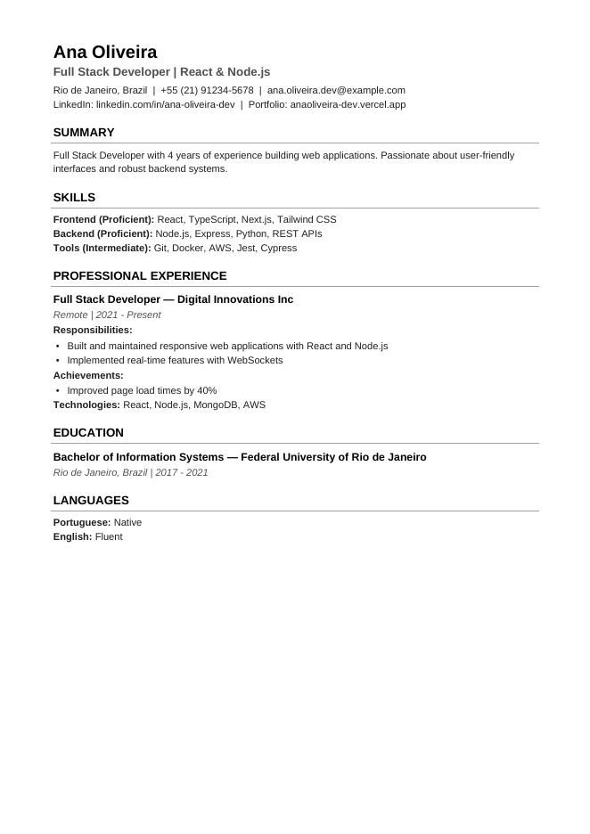

# CV-Craft

[Português](README.md) · **English**

**Professional, ATS-friendly resumes generated from a single YAML file.**

[](https://github.com/fabiodrneles/cv-craft/actions/workflows/ci.yml)
[](https://pkg.go.dev/github.com/fabiodrneles/cv-craft)
[](https://goreportcard.com/report/github.com/fabiodrneles/cv-craft)
[](LICENSE)

You write the content once in YAML; CV-Craft generates the **PDF** to send to recruiters, the **plain text** to paste into application forms and the **Markdown** for GitHub or your portfolio, all with the same content.

<p align="center">
  
</p>

## Why CV-Craft?

- **Single source of truth.** One YAML file, three formats that always match: no filled-in field is left out.
- **Built for ATS.** Single column, selectable text, no tables or images, standard section titles and PDF metadata (title, author, keywords).
- **Proper Unicode.** Accents and special characters render correctly in every format; section titles in `en` or `pt-BR`.
- **Versionable and offline.** Your resume becomes text in Git. Nothing is sent over the internet.
- **Built for scripts.** Works without an interactive terminal, with flags for everything and documented exit codes.

## Installation

Pick your system and follow the steps. Every command block can be copied and pasted whole into the terminal.

### Windows

1. Open **PowerShell**: press the **Windows** key, type `PowerShell` and press **Enter**. It does not need to run as administrator.
2. Copy and paste this command and press **Enter**:

   ```powershell
   irm https://raw.githubusercontent.com/fabiodrneles/cv-craft/main/scripts/install.ps1 | iex
   ```

   It downloads the latest version, verifies the file (checksum), installs it in `%LOCALAPPDATA%\Programs\cv-craft` and adds that folder to your `PATH`, so the `cv-craft` command works in any folder.
3. Check the installation:

   ```powershell
   cv-craft version
   ```

   You should see something like `cv-craft v1.0.0 (...)`. Terminals that were already open before the installation must be closed and reopened to pick up the new `PATH`.

<details>
<summary>Manual installation on Windows (no script)</summary>

1. From [Releases](https://github.com/fabiodrneles/cv-craft/releases/latest), download `cv-craft_<version>_windows_amd64.zip` (or `arm64` on ARM computers).
2. Right-click the file → **Extract All** → choose the folder `C:\Users\<your user>\AppData\Local\Programs\cv-craft`.
3. Add that folder to the `PATH`: press **Windows**, type **environment variables**, open **Edit environment variables for your account**, select **Path** → **Edit** → **New**, paste the folder path and confirm with **OK** in every window.
4. Open a **new** PowerShell and run `cv-craft version`.

</details>

### macOS and Linux

1. Open the **Terminal** (on macOS: **Cmd + Space**, type `Terminal` and press **Enter**).
2. Copy and paste this command:

   ```sh
   curl -fsSL https://raw.githubusercontent.com/fabiodrneles/cv-craft/main/scripts/install.sh | sh
   ```

   It detects your system and processor (Intel/AMD or ARM, like M1/M2/M3 Macs), downloads the latest version, verifies the checksum and installs it in `~/.local/bin`.
3. If the installer says the folder is not on your `PATH`, copy and run the command it prints (it adds `~/.local/bin` to your shell's `PATH`).
4. Check the installation:

   ```sh
   cv-craft version
   ```

> Downloaded the file with a browser on macOS and got "cannot verify the developer"? Run `xattr -d com.apple.quarantine ~/.local/bin/cv-craft` (use the path where you put the file). The installer above does not have this problem.

### With Go

If you already have Go 1.26 or later:

```bash
go install github.com/fabiodrneles/cv-craft@latest
```

### From source

```bash
git clone https://github.com/fabiodrneles/cv-craft.git
cd cv-craft
make build        # builds ./bin/cv-craft (or: go build .)
```

### Update and uninstall

- **Update:** run the same installation command again; it replaces the installed version with the latest one.
- **Uninstall on Windows:** delete the `%LOCALAPPDATA%\Programs\cv-craft` folder and remove it from `Path` (same screen as step 3 of the manual installation).
- **Uninstall on macOS and Linux:** `rm ~/.local/bin/cv-craft`.

## Quick start

From zero to your first PDF:

1. Create a folder for your resume and go into it:

   ```sh
   mkdir my-resume
   cd my-resume
   ```

2. Create the commented template:

   ```bash
   cv-craft init                      # creates curriculum.yaml from a commented template
   ```

3. Open `curriculum.yaml` in an editor and replace the examples with your data (set `meta.locale` to `en` for English section titles). Recommended: [VS Code](https://code.visualstudio.com/) with the [Red Hat YAML](https://marketplace.visualstudio.com/items?itemName=redhat.vscode-yaml) extension, which autocompletes fields and flags errors as you type (see [Editor autocompletion and validation](#editor-autocompletion-and-validation)). In YAML, **indentation with spaces** matters: keep the template's alignment.
4. Generate the PDF:

   ```bash
   cv-craft build curriculum.yaml     # generates curriculum.pdf
   ```

5. Open the result: `start curriculum.pdf` (Windows), `open curriculum.pdf` (macOS) or `xdg-open curriculum.pdf` (Linux).

To generate all three formats at once:

```bash
cv-craft build curriculum.yaml --format all -o dist/
```

To see the PDF update while you edit, use [`--watch`](#build-flags).

## Usage

### Commands

| Command | Description |
|---|---|
| `cv-craft build <file.yaml>` | Generates the resume (PDF, Markdown or text) |
| `cv-craft validate <file.yaml>` | Validates the YAML and lists **all** validation problems at once (a YAML syntax error is reported on its own, first) |
| `cv-craft init [file.yaml]` | Creates a YAML template (default: `curriculum.yaml`); does not overwrite without `--force` |
| `cv-craft schema` | Prints the JSON Schema of the YAML, for editor autocompletion |
| `cv-craft version` | Shows the version |
| `cv-craft help [command]` | General help or help for a command |
| `cv-craft ui` | Interactive mode, with the same commands |

The CLI messages are in Portuguese; the generated resume follows `meta.locale` or `--lang`.

### `build` flags

Flags can come before or after the file.

| Flag | Default | Description |
|---|---|---|
| `-f`, `--format` | `pdf` | `pdf`, `md` (`markdown`), `txt` (`text`) or `all` |
| `-o`, `--output` | next to the YAML | Output file; with `--format all`, a directory |
| `--lang` | `meta.locale` or `pt-BR` | Language of the section titles: `pt-BR` or `en` |
| `-y`, `--force` | — | Overwrites existing files without asking |
| `-q`, `--quiet` | — | Shows errors only |
| `-v`, `--verbose` | — | Shows execution details |
| `-w`, `--watch` | — | Regenerates every time the YAML is saved, until `Ctrl+C` |

If the output file already exists, CV-Craft asks before overwriting when running in a terminal. In scripts and CI it fails with exit code `3`, unless you pass `--force`.

To see the result while you edit, leave `--watch` running in a terminal and keep the PDF open in a viewer that reloads the file:

```text
cv-craft build curriculum.yaml --watch
```

Every time you save the YAML, the resume is regenerated in under a second. If the YAML becomes invalid, the errors are shown and watching continues; once you fix it and save, generation works again. `Ctrl+C` exits with code `0`.

### Exit codes

| Code | Meaning |
|---|---|
| `0` | Success |
| `1` | Unexpected error (e.g. file not found, write failure) |
| `2` | Incorrect usage (invalid command, flag or value) |
| `3` | Output file already exists without `--force`, or operation canceled |
| `4` | Invalid YAML (syntax or validation) |

## YAML format

Minimal valid example:

```yaml
meta:
  locale: en               # en or pt-BR (section titles)

contact:
  name: "Ana Souza"        # required
  email: "ana@example.com" # required
  phone: "+1 (555) 123-4567"
  location: "Austin, TX"
  linkedin: "linkedin.com/in/ana-souza"
  github: "github.com/ana-souza"

professional_title: "Backend Developer"        # required
summary: "Two to four sentences about you."

skills:                    # required: at least one category
  - name: "Backend"
    level: "advanced"      # optional: expert, advanced, proficient, intermediate, beginner
    keywords: ["Go", "PostgreSQL"]

experience:                # required: at least one
  - role: "Developer"
    company: "ACME"
    period: "2022 - Present"
    responsibilities: ["Built REST APIs in Go"]
    achievements: ["Cut latency by 40%"]
    technologies: ["Go", "Docker"]

education:                 # required: at least one
  - degree: "B.Sc. in Computer Science"
    institution: "University of Texas"
```

Experiences also support `work_type` and `description`; education supports `location`, `period`, `thesis` and `relevant_courses`; and there are the optional lists `certificates` (`name`, `institution`, `date`, `url`) and `languages` (`language`, `level`). The full reference, with every field, the accepted levels and the most common errors, is in [`docs/schema.md`](docs/schema.md) (in Portuguese).

Keys with typos are **rejected**, with the path and line (`experience[0].responsabilities: campo desconhecido "responsabilities" (linha 12)`), so nothing silently disappears from the resume.

### Editor autocompletion and validation

The YAML created by `cv-craft init` (and the ones in `examples/`) starts with a line pointing to CV-Craft's [JSON Schema](schema/cv-craft.schema.json). With a YAML extension in your editor ([Red Hat YAML](https://marketplace.visualstudio.com/items?itemName=redhat.vscode-yaml) in VS Code, or the built-in support in JetBrains IDEs), you get field autocompletion, a description of each field on hover and errors flagged as you type: empty required field, misspelled key, invalid email. To work offline, generate a local copy with `cv-craft schema > cv-craft.schema.json` (details in [`docs/schema.md`](docs/schema.md#autocompletar-e-validar-no-editor)).

See complete examples in [`examples/`](examples/README.md): [`en.yaml`](examples/en.yaml) (English), [`full.yaml`](examples/full.yaml) (Portuguese, every field) and [`minimal.yaml`](examples/minimal.yaml) (the `init` template).

## Troubleshooting

| Symptom | Cause and fix |
|---|---|
| `cv-craft: command not found` or "is not recognized as the name of a cmdlet" | The installation folder is not on the `PATH`. On Windows, close and reopen the terminal; if it persists, redo step 3 of the manual installation. On macOS/Linux, run the `PATH` command the installer printed and open a new terminal. |
| `erro: ... já existe` and exit code `3` | The output file already exists and the terminal is not interactive. Use `--force` to overwrite or `-o` for another name. |
| `YAML inválido: ... line N` | Syntax error, almost always indentation (use spaces, never Tab) or text containing `:` without quotes. Put the text in quotes. |
| `campo desconhecido "..."` | Misspelled field name. The message shows the path and line; check the name in [`docs/schema.md`](docs/schema.md). |
| `campo obrigatório` | A required field is empty. Run `cv-craft validate curriculum.yaml` to see all of them at once. |
| PowerShell blocks the installation script | Use exactly the `irm ... \| iex` command above, which does not depend on the script execution policy, or follow the manual installation. |

## Output formats

| Format | When to use |
|---|---|
| **PDF** | Send to recruiters and attach to applications. Clickable links and filled-in metadata. |
| **Text** (`.txt`) | Paste into application forms; maximum ATS compatibility. |
| **Markdown** (`.md`) | GitHub README, portfolio or personal website. |

## Tips for getting through ATS

- Start each responsibility with an **action verb** and use **numbers** in achievements.
- Use the same terms as the job description in your `keywords` (e.g. "Kubernetes", not just "K8s").
- Keep your professional title aligned with the role you are applying for.

## Development

The project follows **Spec Driven Development**: every behavior change starts with a spec in [`specs/`](specs/README.md), and each acceptance criterion becomes a test. The specs and the [contributing guide](CONTRIBUTING.md) are in Portuguese.

```bash
make test     # unit, golden file and CLI tests
make lint     # go vet + golangci-lint
make cover    # coverage (at least 80% in internal/)
make smoke    # end-to-end smoke test with the real binary
make docs     # Markdown lint, links and documentation commands
make ci       # the code checks the CI runs
make golden   # rewrites the golden files after an intentional output change
make schema   # rewrites schema/cv-craft.schema.json from the Go model
make release-snapshot  # builds the release archives in ./dist, without publishing
```

To publish a version, create and push the tag (`git tag vX.Y.Z && git push origin vX.Y.Z`): the release workflow runs the full CI and publishes the binaries. Each version's changes are in the [CHANGELOG](CHANGELOG.md).

The tests that check the PDF text use `pdftotext` (the `poppler-utils` package on Linux, `poppler` on Homebrew) and are skipped if it is not installed.

The roadmap is in [`specs/ROADMAP.md`](specs/ROADMAP.md).

## License

[MIT](LICENSE) © Fabio Dorneles. The Liberation Sans font, embedded in the binary, is distributed under the [SIL Open Font License 1.1](internal/generator/fonts/OFL.txt).
