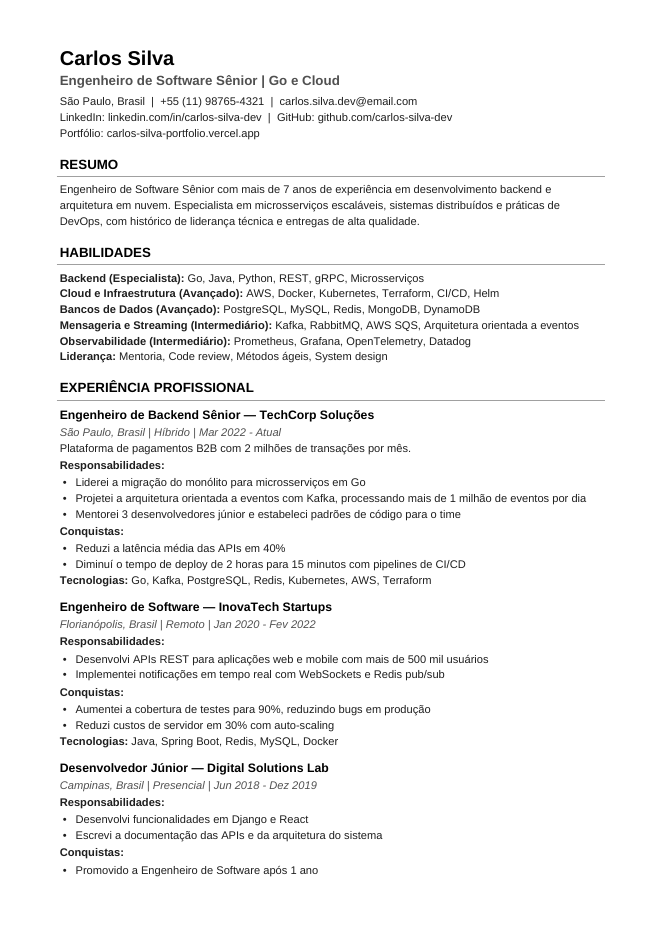

# CV-Craft

**Currículos profissionais e otimizados para ATS, gerados a partir de um único arquivo YAML.**

[](https://github.com/fabiodrneles/cv-craft/actions/workflows/ci.yml)
[](https://pkg.go.dev/github.com/fabiodrneles/cv-craft)
[](https://goreportcard.com/report/github.com/fabiodrneles/cv-craft)
[](LICENSE)

Você escreve o conteúdo uma vez em YAML; o CV-Craft gera o **PDF** para enviar a recrutadores, o **texto puro** para colar em formulários de candidatura e o **Markdown** para o GitHub ou portfólio, todos com o mesmo conteúdo.

<p align="center">
  
</p>

## Por que CV-Craft?

- **Fonte única da verdade.** Um arquivo YAML, três formatos sempre consistentes: nenhum campo preenchido fica de fora.
- **Feito para ATS.** Coluna única, texto selecionável, sem tabelas nem imagens, títulos de seção padronizados e metadados no PDF (título, autor, palavras-chave).
- **Português de verdade.** Acentos e caracteres especiais corretos em todos os formatos; títulos das seções em `pt-BR` ou `en`.
- **Versionável e offline.** Seu currículo vira texto no Git. Nada é enviado para a internet.
- **Feito para scripts.** Funciona sem terminal interativo, com flags para tudo e exit codes documentados.

## Instalação

**Binário pré-compilado** (não precisa de Go): baixe o arquivo do seu sistema em [Releases](https://github.com/fabiodrneles/cv-craft/releases/latest), extraia e coloque o `cv-craft` (ou `cv-craft.exe`) numa pasta do seu `PATH`.

```bash
# Exemplo no Linux (x86-64); troque a versão e o sistema conforme o arquivo baixado
tar -xzf cv-craft_0.1.0_linux_amd64.tar.gz
sudo mv cv-craft /usr/local/bin/
cv-craft version
```

Há arquivos para Linux, macOS e Windows (amd64 e arm64), e o `checksums.txt` permite conferir a integridade do download (`sha256sum -c checksums.txt --ignore-missing`).

**Com Go (1.26 ou superior):**

```bash
go install github.com/fabiodrneles/cv-craft@latest
```

**A partir do código:**

```bash
git clone https://github.com/fabiodrneles/cv-craft.git
cd cv-craft
make build        # gera ./bin/cv-craft (ou: go build .)
```

## Início rápido

```bash
cv-craft init                      # cria curriculum.yaml com um modelo comentado
# edite curriculum.yaml com seus dados
cv-craft build curriculum.yaml     # gera curriculum.pdf
```

Para gerar os três formatos de uma vez:

```bash
cv-craft build curriculum.yaml --format all -o dist/
```

## Uso

### Comandos

| Comando | Descrição |
|---|---|
| `cv-craft build <arquivo.yaml>` | Gera o currículo (PDF, Markdown ou texto) |
| `cv-craft validate <arquivo.yaml>` | Valida o YAML e lista **todos** os problemas de validação de uma vez (um erro de sintaxe do YAML aparece sozinho, antes) |
| `cv-craft init [arquivo.yaml]` | Cria um YAML modelo (padrão: `curriculum.yaml`); não sobrescreve sem `--force` |
| `cv-craft version` | Mostra a versão |
| `cv-craft help [comando]` | Ajuda geral ou de um comando |
| `cv-craft ui` | Modo interativo, com os mesmos comandos |

### Flags do `build`

As flags podem vir antes ou depois do arquivo.

| Flag | Padrão | Descrição |
|---|---|---|
| `-f`, `--format` | `pdf` | `pdf`, `md` (`markdown`), `txt` (`text`) ou `all` |
| `-o`, `--output` | ao lado do YAML | Arquivo de saída; com `--format all`, um diretório |
| `--lang` | `meta.locale` ou `pt-BR` | Idioma dos títulos das seções: `pt-BR` ou `en` |
| `-y`, `--force` | — | Sobrescreve arquivos existentes sem perguntar |
| `-q`, `--quiet` | — | Mostra apenas erros |
| `-v`, `--verbose` | — | Mostra detalhes da execução |

Se o arquivo de saída já existir, o CV-Craft pergunta antes de sobrescrever quando está em um terminal. Em scripts e no CI, ele falha com exit code `3`, a não ser que você use `--force`.

### Exit codes

| Código | Significado |
|---|---|
| `0` | Sucesso |
| `1` | Erro inesperado (ex.: arquivo não encontrado, falha de escrita) |
| `2` | Uso incorreto (comando, flag ou valor inválido) |
| `3` | Arquivo de saída já existe sem `--force`, ou operação cancelada |
| `4` | YAML inválido (sintaxe ou validação) |

## Formato do YAML

Exemplo mínimo válido:

```yaml
meta:
  locale: pt-BR            # pt-BR ou en (títulos das seções)

contact:
  name: "Ana Souza"        # obrigatório
  email: "ana@exemplo.com" # obrigatório
  phone: "+55 (11) 99999-9999"
  location: "São Paulo, SP"
  linkedin: "linkedin.com/in/ana-souza"
  github: "github.com/ana-souza"

professional_title: "Desenvolvedora Backend"   # obrigatório
summary: "Duas a quatro frases sobre você."

skills:                    # obrigatório: ao menos uma categoria
  - name: "Backend"
    level: "advanced"      # opcional: expert, advanced, proficient, intermediate, beginner
    keywords: ["Go", "PostgreSQL"]

experience:                # obrigatório: ao menos uma
  - role: "Desenvolvedora"
    company: "ACME"
    period: "2022 - Atual"
    responsibilities: ["Desenvolvi APIs REST em Go"]
    achievements: ["Reduzi a latência em 40%"]
    technologies: ["Go", "Docker"]

education:                 # obrigatório: ao menos uma
  - degree: "Ciência da Computação"
    institution: "USP"
```

Também são suportados `work_type` e `description` nas experiências; `location`, `period`, `thesis` e `relevant_courses` na formação; e as listas opcionais `certificates` (`name`, `institution`, `date`, `url`) e `languages` (`language`, `level`). A referência completa, com todos os campos, os níveis aceitos e os erros mais comuns, está em [`docs/schema.md`](docs/schema.md).

Os níveis de habilidade também podem ser escritos em português (`avançado`, `intermediário`, `básico`…). Chaves com erro de digitação são **rejeitadas**, com o caminho e a linha (`experience[0].responsabilities: campo desconhecido "responsabilities" (linha 12)`), para que nada suma do currículo sem aviso.

Veja exemplos completos em [`examples/`](examples/README.md): [`full.yaml`](examples/full.yaml) (português, todos os campos), [`en.yaml`](examples/en.yaml) (inglês) e [`minimal.yaml`](examples/minimal.yaml) (o modelo do `init`).

## Formatos de saída

| Formato | Quando usar |
|---|---|
| **PDF** | Enviar a recrutadores e anexar em candidaturas. Links clicáveis e metadados preenchidos. |
| **Texto** (`.txt`) | Colar em formulários de candidatura; máxima compatibilidade com ATS. |
| **Markdown** (`.md`) | README do GitHub, portfólio ou site pessoal. |

## Dicas para passar pelo ATS

- Comece cada responsabilidade com um **verbo de ação** e use **números** nas conquistas.
- Use nas `keywords` os mesmos termos da descrição da vaga (ex.: "Kubernetes", não só "K8s").
- Mantenha o título profissional alinhado ao cargo pretendido.

## Desenvolvimento

O projeto segue **Spec Driven Development**: toda mudança de comportamento começa por uma spec em [`specs/`](specs/README.md), e cada critério de aceite vira um teste. O fluxo completo (tickets, branches, commits, PRs e revisão) está no [guia de contribuição](CONTRIBUTING.md).

```bash
make test     # testes unitários, golden files e CLI
make lint     # go vet + golangci-lint
make cover    # cobertura (mínimo de 80% em internal/)
make smoke    # smoke test de ponta a ponta com o binário real
make ci       # tudo o que o CI roda
make golden   # regrava os golden files após uma mudança intencional nas saídas
make release-snapshot  # gera os binários da release em ./dist, sem publicar
```

Para publicar uma versão, basta criar e enviar a tag (`git tag v0.2.0 && git push origin v0.2.0`): o workflow de release roda o CI completo e publica os binários. As mudanças de cada versão ficam no [CHANGELOG](CHANGELOG.md).

Os testes que conferem o texto do PDF usam o `pdftotext` (pacote `poppler-utils` no Linux, `poppler` no Homebrew) e são pulados se ele não estiver instalado.

O roadmap está em [`specs/ROADMAP.md`](specs/ROADMAP.md).

## Licença

[MIT](LICENSE) © Fabio Dorneles. A fonte Liberation Sans, embutida no binário, é distribuída sob a [SIL Open Font License 1.1](internal/generator/fonts/OFL.txt).
